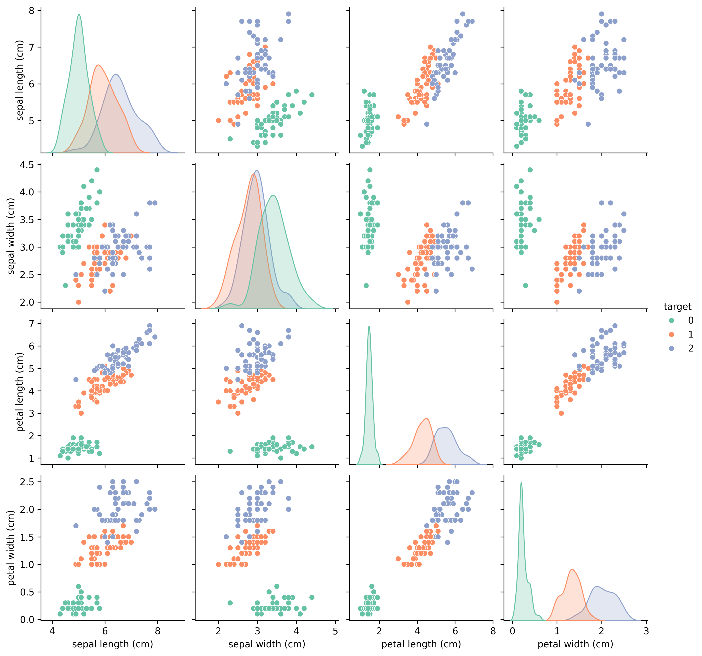
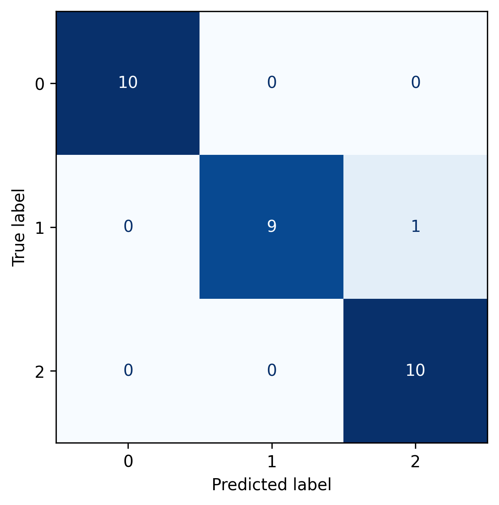

# Iris_EDA
Week 1 ML project – EDA, visualization, and classification of the Iris dataset using Python, pandas, seaborn, and scikit-learn.

# 🌱 Week 1 Project: Iris Dataset Classification

This is a project in my journey to becoming an AI/ML Engineer.  
The goal of this project is to perform **Exploratory Data Analysis (EDA)** and train a simple **machine learning model** to classify iris flowers into species based on their features.

---
## 🔍 Preview Results

### Pairplot of Iris Features

### Example Confusion Matrix

